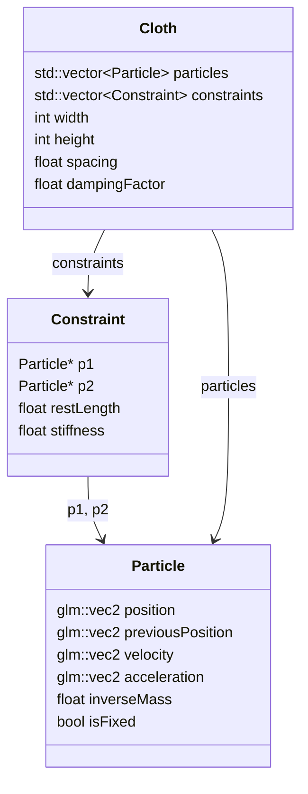
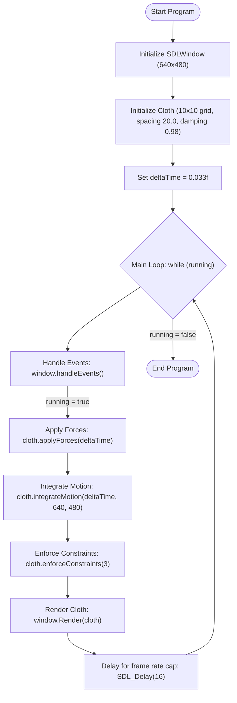

# Exam Project

## Pitch Statment:
> In my exam project, I aim to build an in-depth understanding of Position-Based Dynamics (PBD) and cloth simulation by creating a custom physics engine that produces realistic, visually engaging cloth behaviour in real-time. Drawing on my background in textiles, I will focus on capturing the nuanced “feel” and drape of various fabric types, closely managing the data for optimal performance.
> 
> To enhance the simulation’s realism, I plan to explore shader techniques and material properties, with the ultimate goal of showcasing an interactive demo that brings cloth to life through both physical accuracy and aesthetic detail.

## Milestones (draft)
| Period | Topics                                                       |
|--------|--------------------------------------------------------------|
| Week 1 | Test-project setup in SDL; initial exploration of PBD fundamentals and simulation requirements alongside research. |
| Week 2 | Develop basic particle and constraint systems, establish particle structure with position, velocity, acceleration, and mass properties. Decide on what to present in final demo. |
| Week 3 | Implement core PBD algorithms, create initial constraints like distance and log tests for stability and structure. |
| Week 4 | Introduce cloth-specific constraints like structural and bending, begin investigating damping and integration methods for smoother motion. |
| Week 5 | Start shader programming, experiment with basic material properties to influence cloth look and feel. |
| Week 6 | Optimise performance for real-time interaction, test appearance and response with varied cloth properties. |
| Week 7 | Prepare for interactive demo; finalise adjustments to physical accuracy, visual fidelity, and responsiveness. |

## Key Features:
1. **Custom Physics Engine**: Built to support real-time, life-like cloth simulation through Position-Based Dynamics.
2. **Textile-Inspired Constraints**: Including structural and bending constraints to mimic real fabric behaviours.
3. **Interactive Cloth Demo**: Designed to showcase simulation under various conditions, emphasising realism.
4. **Shader-Driven Material Properties**: Enhances cloth appearance through draping effects, translucency, and texture.
5. **Optimisation for Real-Time Use**: Data and code structures fine-tuned for responsiveness and efficiency.

## Class/Struct dependencies:

## Main loop outline:

 
